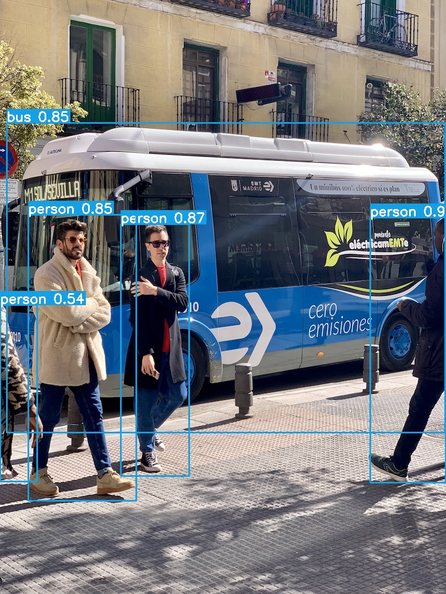

# YoloV5

## Model Structure

YOLOv5 is a model based on a single-stage object detector, which adopts CSPNet and SPPNet structures and achieves the latest performance in classification and detection tasks. YOLOv5 divides the input image into grids of different sizes and predicts the categories and bounding boxes of all objects present in each grid. This model has fast inference speed and high accuracy, and is suitable for various computer vision tasks such as real-time object detection and face detection.


## Environmental Configuration

step1:Install opencv

```bash
#instal opencv4.6
wget https://github.com/opencv/opencv/archive/refs/tags/4.6.0.tar.gz
cd opencv
mkdir build
cd build
sudo cmake -D CMAKE_BUILD_TYPE=Release -D CMAKE_INSTALL_PREFIX=/usr/local ..
make
make install
```

step2:Clone the project and modify the directory where the local ORT is located and compile it

```bash
git clone xxx.git
mkdir build
cmake ..
make
./YOLOV5
```

## Renderings

### FP32

<div style="text-align:left;">
  
</div>


## Reference

https://github.com/ultralytics/yolov5     
https://github.com/itsnine/yolov5-onnxruntime
